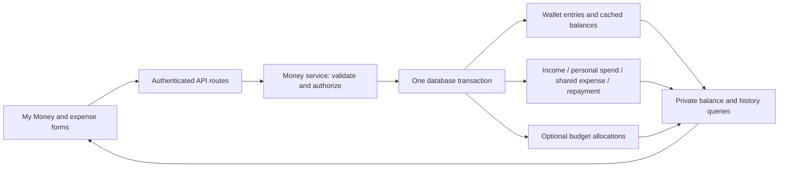

# My Money: implementation and original design

## Live app

Implemented on `feat/my-money-integration`. Open **My Money** in the desktop sidebar or mobile **More** menu, or visit `http://localhost:3100/money` during local development.

- Responsive overview, swipeable wallet cards, balance chart, monthly income and personal spending, activity filters and pagination.
- Cash and Bank defaults plus private, reusable custom wallet types. Wallet names remain separate. Types can be renamed or archived.
- Wallet creation, income, personal spending, transfers, confirmed shared payments, balance adjustments, archive/restore, and traceable reversals.
- Optional wallet and budget selection in shared expenses. A 300 MAD payment split between three people deducts 300 MAD from the selected wallet and counts 100 MAD as your spending/budget usage. Without a wallet selection, wallet cash stays unchanged.
- Six-jar budgets with exact cent allocation, editable private plans, budget transfers, and history. `/jars` now opens `/money/budgets`.
- Wallet selection in borrowing, lending, and repayment forms. Repayments never count as earned income. Records with repayments cannot be deleted.
- Owner-scoped API reads and writes; transaction locks; duplicate-request protection for money operations; failed payments roll back balances and their linked records together.
- The `feature_personal_finance` admin setting controls navigation and access to the new money/wallet APIs.

Each currency has separate totals. Transfers require matching currencies. Older wallets with ambiguous currency require confirmation before use. Existing balances become a dated opening entry; the app does not invent historical cash movements. Accepted shared payments must be recorded into a wallet explicitly, once per person. Old global payments without a recorded currency are excluded from wallet posting.

The local pre-change source and database are saved. See [restore instructions](RESTORE_PRE_MY_MONEY.md) for tag `restore/pre-my-money-2026-09-13`, checkpoint `e5965b6`, and the verified database dump. No remote push or production deployment is part of this implementation.

Validation scripts: [`check_money_migration.py`](../backend/tests/check_money_migration.py), [`check_money_integration.py`](../backend/tests/check_money_integration.py), and [`check-money-ui.cjs`](../scripts/check-money-ui.cjs). Financial integration checks use a separate `spliteasy_money_check_20260913` database restored from the backup; they never write test payments to `spliteasy_dev`.

Verified on 2026-09-14:

- Production `next build` passes with `NODE_ENV=production`, in a temporary directory separate from the running development server.
- TypeScript check, backend imports, existing smoke checks, and `git diff --check` pass.
- 78 API checks cover ownership, duplicate submissions, insufficient funds, concurrent withdrawals, shared-expense edits/unlink/refund, income corrections, budget allocation/reversal, repayments, currency filters, and journal-to-wallet reconciliation.
- Migration runs twice without changing balances or duplicating opening entries, including a seeded legacy wallet with an unknown currency and custom type.
- Browser checks cover widths 320, 390, 768 and 1440, dark mode, mobile actions, account privacy, persistence, wallet/type creation, income, spending, balance adjustments, shared-expense payment, borrowing/repayment, budget plans and budget history.
- Main development database has no `moneycheck_*` test users. Its real wallet activity is preserved. The original backup checksum still matches the restore guide.

To rerun the financial suite, start the isolated `spliteasy-money-check` container and run `docker exec spliteasy-money-check python -m tests.check_money_integration`. It verifies that its database name contains `money_check` before writing fixtures. Browser checks require Playwright Core and Chrome; set `PLAYWRIGHT_MODULE` to the installed module path and pass a local copy of the isolated container's `/tmp/money-browser.json` to `node scripts/check-money-ui.cjs`. Add `--forms` for the mobile expense/repayment checks. Keep these fixtures in the separate test database.

## Original review and design notes

The following records the pre-implementation assessment and rationale. Statements about missing capabilities refer to that baseline.

Reviewed against the current working tree on 2026-09-13. This is an integration proposal, with a [clickable design preview](previews/my-money.html). The preview uses clearly labelled sample data and never calls the application API.

**Recommendation:** introduce one private **My Money** area for wallets, income, personal spending, and budgets. Connect it to shared expenses through an optional payment source. Build on the existing backend after fixing its balance updates and record lifecycle.

The requested scope now includes personal money management. When implementing this proposal, update the older expense-sharing-only wording in `CLAUDE.md`, the design contract, and navigation comments to describe this optional module. Keep the existing visual primitives and the shared-expense workflow.

## Baseline before integration

| Capability | Backend evidence | Frontend status |
|---|---|---|
| Wallet creation, listing, editing, deletion | [`routers/wallets.py`](../backend/app/routers/wallets.py), [`models/finance.py`](../backend/app/models/finance.py) | No wallet page or wallet API client found |
| Transfers between a user's wallets | `POST /wallets/transfer` | No transfer flow |
| Income and income categories | `/incomes`, `/incomes/summary`, `/incometype/`; [`repositories/finance.py`](../backend/app/repositories/finance.py) | No client/page for wallet income; jar income is a different flow |
| Transaction records | `GET /transactions`, `GET /transactions/{id}` | No unified wallet history; current records cover transfer/debt/credit types |
| Shared expense linked to a wallet | `Expense.wallet_id`, [`repositories/expense.py`](../backend/app/repositories/expense.py) | API payload type has `wallet_id`, but the form, domain mapping, and store submission do not carry it through |
| Borrowing, lending, repayments | [`routers/debts_loans.py`](../backend/app/routers/debts_loans.py) accepts optional wallets and changes their balances | `/debts-loans` is already implemented; its input types/forms omit wallet selection |
| Six-jar budgeting | `/econome`: strategies, distributions, spending, transfers, balances, history | `/jars`, existing jar components, API client, and store integration exist; absent from primary navigation |
| Summaries | `/dashboard/summary`, `/incomes/summary`, `/econome/monthly-summary` | Definitions differ; they cannot be combined into a trustworthy cash balance as-is |

Read-only API checks against local development with the demo account returned HTTP 200 for `/wallets`, `/incomes`, `/incomes/summary`, `/transactions`, `/incometype/`, `/debts-loans/summary`, `/econome/strategies`, `/econome/balances`, `/econome/ledger`, and `/dashboard/summary`. Wallet/income/transaction/strategy lists were empty; six jar balances were returned. This verifies availability, not money-changing behavior. No wallet transfers, deletions, or new financial records were executed for this review.

## Product structure

Add **My Money** to desktop navigation. On mobile, put it in the existing **More** menu initially; provide Income, Spending, and Transfer actions inside My Money. Retain the current Home / Groups / Add / Expenses navigation.

| Screen | Main question | Contents and actions |
|---|---|---|
| `/money` — Overview | What do I have, and what changed? | Wallet balances by currency, income this month, my spending this month, recent activity; Add income as primary action |
| `/money/wallets` — Wallets | Where is my money? | Wallet cards with name, suggested or custom type, currency, balance; Create wallet, Transfer, open details |
| `/money/wallets/[id]` — Wallet detail | Why is this balance what it is? | Opening balance and chronological entries; filter by date/type; Rename, Adjust balance, Archive |
| `/money/activity` — Activity | What came in or went out? | One paginated history with Income, Spending, Transfer, Reimbursement, Loan, Adjustment labels |
| `/money/budgets` — Budgets | How much of my plan remains? | Reuse the six jars after fixing their data flow; allocation, spent, remaining, strategy settings |

Keep **Debts & Loans** at its current route and link to it from My Money. Reuse it rather than build a second debt system. The existing **Balances** screen continues to mean balances between people; wallet cash belongs under My Money.

Wallet names, balances, income sources, and budget choices are private. Group participants can see who paid and how the expense was split. They must not receive another person's private wallet details in API responses.

### First use and everyday flows

1. **Create first wallet:** name, type (suggest Cash and Bank; also accept the user's own type), currency, opening balance, effective date. Examples of custom types: Freelancing, Gift, and Bonus (Prime). Explain that the opening balance is money already held. Offer an explicit zero-balance start. A custom label does not add special accounting behavior such as credit limits or bank synchronization.
2. **Add income:** amount, received into, income source, date, note. Show the resulting wallet balance. Optionally allocate this same income into jars after the budget integration is ready; do not ask the user to enter it again.
3. **Record personal spending:** amount, description, paid from, category/date, optional jar. It needs no group. The existing group-expense API is not a complete personal-spending API: its read schema requires a group and the implementation dereferences the group.
4. **Transfer:** from wallet, to wallet, amount, note; show both resulting balances. Transfer changes neither income nor spending. V1 accepts matching currencies only.
5. **Shared expense:** retain the existing Add Expense form. When **Paid by = You**, show optional **Pay from** with an explicit **Don't track in a wallet** choice. Never select an arbitrary wallet silently. When somebody else paid, do not offer their wallets or debit your own wallet.
6. **Reimbursement:** link the confirmed group payment to a private wallet entry. Treat it as repayment, not salary/income. Each person chooses their own wallet; the counterparty never chooses it for them.
7. **Correct a record:** show old and new wallet effects. On failure, keep the entered values and leave every balance unchanged. Archive used wallets; corrections to money create traceable adjustment or reversal entries.

### Wallet page: visual direction from the supplied reference

The [interactive preview](previews/my-money.html) now opens on **Wallets**. It adopts the reference's colourful balance cards, compact income/spending summaries, grouped transaction rows, circular chart, and raised mobile add action. The visual treatment uses SplitEasy's violet, rounded cards, and light/dark theme tokens. Cash and custom types have their own card treatments; wallet names and type labels stay separate.

| Desktop | Mobile |
|---|---|
| Two columns: balances, wallet cards, quick actions, and recent activity on the left; monthly totals, balance distribution, and reimbursements on the right | One column with horizontally swipeable wallet cards, four quick actions, monthly totals, and grouped activity |
| Two wallet cards visible at once, with previous/next controls for additional wallets | A partial next card signals horizontal scrolling; previous/next controls also support keyboard and tap navigation |
| Overview / Wallets / Activity / Budgets tabs | A compact dark navigation bar with a raised **+** opening an action sheet |
| Centred forms for recording activity and creating wallets/types | Bottom sheets with visible close and save actions, safe-area spacing, and 44px touch targets |

The chart shows **where the wallet balance is held**, using actual sample wallet balances and a text legend. Monthly spending means the user's own share. Recent activity shows the full wallet payment and its personal share separately. Income, transfers, reimbursements, and opening balances retain their distinct accounting behavior.

The bottom navigation demonstrates the My Money module in this standalone preview. For the live app, place the module within the existing app shell via **More**; keep its section navigation within the page when the application's primary bottom navigation is present.

Review captures: [desktop](previews/wallet-desktop.png), [mobile page](previews/wallet-mobile.png), and [mobile add menu](previews/wallet-mobile-actions.png). Browser checks cover 320–1440px widths, carousel navigation, mobile section navigation, the add sheet, custom type/wallet creation, reactive totals and chart, wallet history, keyboard tabs, and dark mode. The preview uses local sample data, resets on reload, and makes no application or external API requests. Live integration remains part of the implementation phases below.

### Wallet types: a private catalog for each user

**Cash** and **Bank** are shared default wallet types. Each user can create additional **wallet types** such as **Freelancing**, **Gift**, or **Prime**. Types are independent records: creating **Freelancing** adds it to the creator's type list, even if they cancel creating a wallet. It remains available for reuse. Wallet name is a separate field.

| Type | Creator / owner | Who can see and select it? |
|---|---|---|
| Cash | System default | Everyone |
| Bank | System default | Everyone |
| Freelancing | Samir | Samir only |
| Gift | Another user | That user only |

In Create Wallet, show a **Wallet type** selector and an **Add wallet type** action. The inline creation form has a type label and the explanation **Only visible to you**. Creating the type selects it for the current wallet draft. Two users may independently create the same label; their records remain separate.

Trim whitespace, require a nonempty label, allow up to 50 characters, and match labels without case sensitivity while preserving their display spelling. Deduplicate within the current user's accessible catalog. Include every type in wallet totals and offer the owner's types in filters. Type labels organize wallets; they do not determine whether a transaction is income, spending, or a transfer.

**Verified backend distinction:** `Wallet.category` currently accepts custom text and wallets have `user_id`, but there is no separate `WalletType` model or wallet-type CRUD API. The existing [`IncomeType`](../backend/app/models/finance.py#L52) and [`/incometype/` routes](../backend/app/routers/income_types.py) already demonstrate the requested ownership pattern: `user_id IS NULL` for shared defaults, otherwise the creator's ID. Reuse the pattern for wallet types, keeping the two catalogs independent.

Proposed implementation: `WalletType(id, name, name_key, user_id, archived_at)`, with nullable `user_id` reserved for system defaults. `GET /wallet-types` returns defaults plus records where `user_id == current_user.id`. `POST /wallet-types` always sets ownership from authentication; clients cannot choose an owner or publish a global type. Updates/archive allow only the owner's custom types. Enforce per-owner uniqueness of normalized names and separate uniqueness for global defaults. A wallet references `wallet_type_id`; create/update must reject another user's type ID even if it is known. A used type is archived rather than deleting linked wallets.

Migrate legacy category labels into the two shared defaults or owner-specific type records, and link each existing wallet. Preserve the existing API category display field during transition where required. Do not derive the catalog solely from wallets: a newly created type must exist without any wallet and remain after its last wallet is archived. The prototype keeps a separate in-memory type catalog to demonstrate this lifecycle; production persistence and authorization still need implementation.

### The accounting distinction the UI must teach

For a **300 MAD dinner shared equally by three people, paid by you**:

| Measure | Effect |
|---|---:|
| Your payment wallet | −300 MAD |
| Your personal spending | 100 MAD |
| Others owe you | 200 MAD |
| Optional budget consumption | 100 MAD, your share |
| Later reimbursement into your wallet | +200 MAD; income unchanged |

A wallet describes where money is held. A jar describes its purpose. Assigning 100 MAD to a jar does not create another 100 MAD of cash. A wallet-to-wallet transfer is not spending; a jar-to-jar transfer is not income. A shared-expense receivable is not cash already available.

Budgeting someone else's share is outside your private budget. If another person paid the bill, your own share can be classified for budgeting independently of a wallet payment. Recording its later settlement must not count that spending a second time.

### Visual and interaction rules

Reuse `PageHeader`, `StatCard`, `PageTabs`, `FilterDropdown`, `Dialog`, `Pagination`, `Avatar`, and `fmt()`. Match the existing violet actions, teal settlements, and textual money-direction labels. Use one primary action per screen, 44px touch targets, mobile cards, keyboard focus, and light/dark tokens. Every mutation needs a saving state and an error that preserves inputs.

Show real empty states and loading skeletons. A failed request must not reveal sample financial balances. Keep sample data only in an explicit demo/preview. Label totals by currency and date range; do not sum MAD and EUR as though they were the same unit.

## Backend findings to fix before connecting money-changing UI

These are source-level findings. Dangerous operations were not reproduced against the user's database.

| Priority | Finding and evidence | Required change |
|---|---|---|
| P0 | Wallet deletion is configured to cascade into incomes, expenses, and transfers: `Wallet` relationships in [`models/finance.py`](../backend/app/models/finance.py#L29). Expense deletion also removes splits. | Add archive/status; preserve financial and group history. Review both ORM cascades and database foreign keys before any destructive operation. SQLAlchemy's [cascade documentation](https://docs.sqlalchemy.org/en/20/orm/cascades.html) confirms these relationships propagate deletion. |
| P0 | [`update_wallet_balance`](../backend/app/repositories/expense.py#L32) commits internally. Expense update refunds the original amount before trying the new debit, with expense fields already modified. | One transaction for validation, wallet changes, expense/split changes, and linked budget entries. Helpers flush if needed but never commit independently. A failed debit must roll everything back. |
| P0 | Private money authorization is inconsistent. Expense creation accepts payer/group/split IDs without a membership check in that call path; wallet validation runs only when the authenticated user is the payer. Jar expense creation can target the supplied payer. Expense reads expose wallet names. | Validate group and participant permissions, derive actor server-side, validate all wallet ownership references, mask private fields, and prevent another group member's action from directly manipulating a private wallet or jar. |
| P1 | Wallet `balance` is freely editable and opening balance has no ledger record. `Transaction` has no complete set of income/spending/settlement source links. | Record opening balances and adjustments as entries; establish a unified wallet journal with stable source references. Every balance change must have a corresponding entry. |
| P1 | Transfers, income, and other wallet updates read a balance and overwrite it without a lock/version check. Retry protection is absent in the inspected paths. | Lock affected rows in a deterministic order or use versioned/conditional updates; add idempotency keys and uniqueness constraints. PostgreSQL [row locking](https://www.postgresql.org/docs/16/explicit-locking.html#LOCKING-ROWS) provides a supported basis for serializing conflicting updates. |
| P1 | Wallets have no currency, while group expenses do. Schemas use floats; income uses `Decimal(data.amount)`; jar amounts use SQL `Float`. | Add explicit currency; initially reject cross-currency transfers and wallet/expense mismatches. Use `Decimal` and `Numeric` for money, finite/positive amount validation, and deliberate rounding. [Pydantic decimal constraints](https://docs.pydantic.dev/latest/api/standard_library_types/#decimals) support bounded decimal inputs. |
| P1 | Expense wallet effects depend on who edits/deletes: group-owner deletion skips the payer's refund. Removing `wallet_id` is also ambiguous because `None` falls back to the original wallet in update logic. Jar debits have no expense reference and are not reversed by the inspected edit/delete paths. | Store private money-event links. Distinguish omitted fields from explicit null. Give linked entries a defined edit/reversal lifecycle independent of the actor; require the wallet owner's confirmation when another person's expense edit would change private money. |
| P1 | Debt/loan deletion reverses original principal but cascades repayment records without reversing their wallet effects: [`delete_debt`](../backend/app/routers/debts_loans.py#L213), [`delete_loan`](../backend/app/routers/debts_loans.py#L555). | Archive records with payments, or reverse the complete sequence transactionally. Never lose repayment history while leaving its cash effects. |
| P1 | Wallet `Income` and jar `IncomeLog` are independent. Jar distribution has no wallet/income link; monthly jar summary counts all positive entries, including internal transfers. Distribution fetches a strategy by ID without checking user/global ownership. | Link budget allocations to an existing income/event; use explicit entry types, scoped strategy access, and exact allocation totals. Stop using description text or amount sign as the only classification. |
| P1 | Current summaries and UI fallback can mislead. Wallet summary expects `Cash`/`Bank` while defaults use `cash`/`bank`; `/dashboard/summary` is income minus full paid bills; jar `totalInJars` uses income rather than remaining balances; the store can retain sample data on API failure. | Normalize category labels while retaining custom types; return totals for every type. Define separate cash, personal-spending, and receivable totals. Compute jar balances from entries. Clear/reset user-specific data and show errors instead of seed balances. |

Concrete partial-commit example inferred from the expense code: a wallet currently has 400 MAD after a 100 MAD expense. An attempted edit to 700 MAD first commits the 100 MAD refund (wallet becomes 500 MAD), then the 700 MAD debit fails. The first commit can also flush the changed expense amount before its splits are updated. Removing the inner commit is necessary before exposing a wallet selector.

Additional cleanup: validate an updated income category's ownership as on create; replace the import-time `IncomeBase.date = datetime.utcnow()` default with a per-request factory; normalize timezone-aware dates; paginate money histories; reject invalid types instead of silently labelling them transfers.

## Engineering design

Use the existing API/repository/service layering. Introduce a small money service coordinating existing income, expense, and loan records rather than putting further balance-changing logic in route functions.

Suggested new concepts (proposed, not present today):

- `MoneyEvent`: owner, type, occurred-at, source type/id, idempotency key, revision/reversal reference. Records what happened once.
- `WalletEntry`: event, owner, wallet, currency, signed `Numeric` amount. A transfer creates two opposite entries with one event. Opening balance is an entry. The cached wallet balance must reconcile to the entries.
- `PersonalSpend`: owner, description, amount, currency, category, date; no group requirement. Shares the money service with group expenses but does not manufacture a hidden group.
- `BudgetEntry` or evolved `JarTransaction`: owner, jar, source event or personal split, signed allocation/consumption, explicit type. A unique source/revision prevents duplicate budget consumption.
- `WalletType`: shared Cash/Bank defaults and custom type records owned by their creator; names up to 50 characters, normalized name key, optional archive date.
- `Wallet`: currency, `wallet_type_id`, archived-at, optional version. Validate the referenced type against the authenticated user's accessible catalog. No unrestricted balance field in ordinary rename/edit requests.

Keep cash movement and personal-spending attribution distinct. Add an owner-scoped link for wallet posting to a shared expense or settlement; do not place the private wallet choice in a group-visible response. An accepted settlement and its cash-recording confirmation are separate facts. A private wallet posting occurs once when its owner confirms the money actually moved; retries or the counterparty's acceptance cannot post it again.

All balance-writing paths must use the same transaction and locking rules, including legacy income/loan endpoints. For an edit affecting another person's linked wallet, return a clear `wallet_confirmation_required` state and retain the owner's last confirmed cash record until they reconcile it. Do not silently refund or debit a wallet from a group-owner edit.

### Frontend and API wiring

| Work | Implementation location |
|---|---|
| Wallet API client and types | New `frontend/lib/api/wallets.ts` and wallet-type client for `/wallet-types`; finance-specific types alongside existing API types |
| Income/category clients | New `frontend/lib/api/incomes.ts`, using actual `/incometype/` route |
| My Money screens | New `frontend/app/money/` routes; dedicated finance hooks/context loaded on demand |
| Optional payment source | `ExpenseForm.tsx`, expense domain type, API mapper, `store.tsx` create payload, and Edit Expense payload; preserve an existing link on unrelated edits |
| Wallet-aware loans | Extend `frontend/lib/api/debts.ts` and existing debt/repayment forms |
| Budgets | Adapt existing `/jars` and `economeApi`; redirect old URL only when the integrated screen is ready |
| Navigation | `Sidebar.tsx` and `MobileBottomNav.tsx`; use a server-controlled `personal_finance` rollout flag |
| Backend orchestration | New `backend/app/services/money.py` and repository helpers; route handlers delegate to them |

Existing `/wallets`, `/incomes`, and `/wallets/transfer` can retain their routes after hardening. Proposed additions are `/wallets/{id}/entries`, `/wallets/{id}/adjustments`, wallet archive support, `/money/summary`, `/money/activity`, `/money/spending`, and owner-scoped links for shared expense/settlement posting. Define schemas and authorization before generating the client. Return money consistently as decimal strings or documented minor-unit integers; the browser does not calculate authoritative balances.

After a successful mutation, invalidate affected wallets, activity, money summary, linked group balances, and budgets. Do not display an optimistic authoritative cash balance before the server confirms it. Keep finance fetching out of every unrelated page's initial load.

### Existing data and rollout

1. Fix transaction boundaries, authorization, deletion behavior, currency policy, and decimal validation. Add targeted tests first for the partial-commit and history-loss cases.
2. Add wallet entries and archive fields through migrations. Preserve existing rows. Because old balance edits and some transactions have no complete history, capture a dated reconciliation/opening entry at cutover; do not invent past movements or add historical income again on top of the current balance. Preserve legacy records for inspection and label them as pre-migration history.
3. Migrate currency only where it can be established from trustworthy configuration/history; flag ambiguous wallets for review. Normalize wallet types. Review migration SQL and rollback steps against a database copy before deployment.
4. Ship Wallets, wallet detail/history, and income first. Enable transfers once paired entries, lock ordering, and idempotency tests pass. This is the first useful My Money release.
5. Add personal spending and optional wallet posting from Add Expense. Then connect settlements and existing loans using the same event lifecycle.
6. Integrate Budgets last: one income entry, linked allocation, correct personal-share spending, explicit transfers, corrected summaries, real empty/error states.

### Acceptance checks

- A user cannot read or change another user's wallets, sources, allocations, or private transaction links, even when they share a group.
- Cash and Bank are shared defaults; a user can independently create and reuse custom wallet types. Cancelling a wallet draft does not delete a type already created. Whitespace-only labels are rejected and case variants deduplicated per owner. Another user cannot list, select, rename, or archive the custom type, including by submitting its ID directly. Identical labels created independently by two users remain separate records.
- A failed expense edit, transfer, or repayment changes no rows or balances. Concurrent withdrawals cannot overwrite each other or overspend a wallet. Duplicate requests produce one event.
- A 300 MAD shared bill paid by you posts −300 cash and 100 personal spending for a three-way split; a 200 MAD reimbursement increases cash without increasing income or spending again.
- Transferring 200 MAD between your wallets preserves total money and produces a linked pair of entries; jar transfers preserve total budget allocation and do not increase income.
- Reassigning payer/wallet, clearing an optional wallet, deleting/reversing a record, and modifying an expense as group owner have defined, tested results.
- Wallet archive preserves incomes, expenses, splits, transfers, and repayment history. Loan archive/correction does not erase repayment evidence.
- Mixed currencies are separated; incompatible transfer/payment sources are rejected. Decimal rounding and budget allocation preserve the exact total.
- Fresh accounts show onboarding, failed requests show errors, switching users resets private state, and no production failure displays mock balances.
- Mobile, dark mode, keyboard use, empty lists, long histories, save errors, and confirmation copy are checked in a browser. Prototype interaction checks are not substitutes for these production tests.
