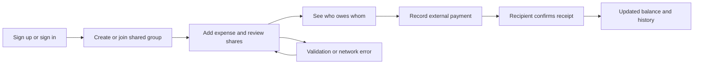

**SplitEasy combined engineering and UX/UI review — 12 September 2026**

SplitEasy has a substantial foundation for a PFE: a recognizable expense-sharing product, a layered backend, typed frontend, reusable UI components, real-time features, administrative permissions, Docker packaging, and CI. The highest-value next step is to make authorization and money calculations dependable. Several current defects affect the core promise: showing who owes what.

This review covers the working tree, including existing uncommitted changes, across backend routes/repositories/models, frontend state and core screens, database setup, Docker, CI, tests, and documentation. Findings are based on source inspection unless explicitly described as reproduced. No application code, dependencies, or database records were changed; this document is the review deliverable. A full browser session and live PostgreSQL integration suite were not run.

The second pass extends the original 21 improvement areas with items 22–34, expands item 11, and replaces the implementation order with a combined roadmap. It adds interaction design, mobile navigation, onboarding, accessibility measurements, account isolation, and concurrent settlement behavior. Recommendations are marked separately from demonstrated source defects. Priorities reflect impact on users, not how noticeable an issue is in a screenshot.

**Fix before allowing real users**

1. **Critical — Restrict account updates and use immutable JWT identities.**

   `backend/app/routers/users.py:72` and `:110` allow an authenticated caller to update or deactivate a supplied user ID without checking ownership or administrative permission. Tokens use a mutable username, and `backend/app/core/auth.py:34` and `:46` issue/resolve that username. Together, the defects permit a source-traced account takeover when token versions match: a token can resolve a different account after usernames are reassigned. Restrict profile changes to the account owner or an explicitly authorized administrator; use the immutable user UUID as JWT `sub`. Reduce the fields exposed by the general user directory as well.

   Acceptance check: account A cannot edit/deactivate B; renaming an account never changes which UUID an existing token identifies.

2. **High — Apply group authorization to every expense access path.**

   Expense creation at `backend/app/routers/expenses.py:32` and `backend/app/repositories/expense.py:46` does not verify caller membership, payer membership, or participant membership. Creation also trusts client-supplied `added_by` at repository line 58. Expense detail at repository line 150 accepts the current user but does not authorize access. In `backend/app/routers/stats.py:37`, providing `user_id` bypasses the membership filter; the spreadsheet template route at `backend/app/routers/expenses.py:227` also lacks membership authorization.

   Centralize resource-access checks, validate every participant against the group, and derive `added_by` from the authenticated caller. Apply this policy to detail, creation, import/template, and statistics routes.

   Acceptance check: an outsider with a valid token and known group/expense IDs cannot view private records, create debts, impersonate a payer, or retrieve group statistics.

3. **High — Prevent ordinary group members from changing ownership.**

   `backend/app/routers/groups.py:30` accepts an unrestricted dictionary after checking membership. `backend/app/repositories/group.py:102` assigns any matching model attribute, including `owner_id`. A member can therefore change ownership and defeat the owner-only deletion check. Introduce a typed update schema with an explicit field allowlist, require appropriate permissions, and make ownership transfer a separate operation. Do not allow currency changes to relabel historical amounts silently.

4. **High — Enforce suspension on existing sessions.**

   `backend/app/core/auth.py:41` checks token version but does not reject inactive accounts. `backend/app/services/admin.py:36` changes account status without revoking those sessions. The WebSocket handshake has the same inactive-account omission. Check active status centrally and revoke sessions on suspension/deactivation. Define the intended session behavior after password changes and force logout, including established WebSockets.

**Make the monetary records internally consistent**

5. **High — Reject invalid split totals instead of moving arbitrary differences onto one person.**

   `backend/app/repositories/expense.py:93` and `:247` assign the entire discrepancy to the first participant. A 100 expense with submitted shares of 10 and 200 becomes shares of **-100 and 200**. The arithmetic was reproduced in isolation. An amount-only update at line 224 can also retain splits for the old total.

   Validate positive finite expense amounts, nonnegative finite shares, unique participants, and exact totals at currency precision. Require or recalculate splits when the total changes. Keep Decimal or integer minor units throughout the calculation. Allocate rounding remainders through a documented algorithm; reject material discrepancies. Add appropriate database constraints as a second layer.

6. **High — Commit each expense and its balance changes in one transaction.**

   `backend/app/repositories/expense.py:42` commits inside the wallet helper. Updating an expense refunds the old amount before attempting the new debit at lines 234–237. An isolated execution of the actual functions with a memory-only session reproduced this scenario: changing a 100 expense to 200 with a wallet balance of zero returns an insufficient-balance error after committing an expense amount of 200 and a wallet balance of 100.

   Use one transaction for the expense, splits, and associated balance changes. Helpers should flush rather than commit. Lock affected balances or use atomic conditional updates where concurrent requests could otherwise overwrite each other. A failed request must leave all related records unchanged.

7. **High — Keep global balances and settlements separate by currency.**

   `backend/app/repositories/settlement.py:266` adds balances across groups without currency separation; line 295 accumulates them into one number. `GlobalSettlement` in `backend/app/models/settlement.py:37` has no currency field. Consequently, 100 MAD and 100 EUR can become 200, while the frontend labels the total with the preferred currency.

   Return balances keyed by person and currency, and store settlement currency. For a manageable first implementation, settle each currency independently. Any later conversion feature needs explicit rates, timestamps, rounding, and stored conversion results.

8. **High — Import spreadsheets through the same validated expense service.**

   `backend/app/routers/expenses.py:418` calculates shares using every selected username and then silently skips unknown names. Selecting Alice and a misspelled name for a 100 expense can persist only Alice's 50 share. Payers and participants are not consistently restricted to the group. Import also hardcodes MAD at line 397 and increments the reported added count per split at line 449.

   Validate all names and amounts before persistence, report row-specific errors, use group currency, count expenses correctly, and define whether an import is all-or-nothing or explicitly partial. Reuse the normal creation service.

9. **High — Base group-leaving rules on outstanding obligations.**

   `backend/app/repositories/group.py:124` checks for nonzero settlement records rather than computing outstanding debt. A member can leave with unpaid expenses if no settlement exists; an accepted or rejected settlement can prevent leaving indefinitely. Removing membership can also make the debt disappear from global calculations that depend on shared groups.

   Define a clear policy for debt and pending settlements, enforce it on both leaving and member removal, and preserve historical obligations.

10. **Medium — Fix settlement edge cases and deletion behavior.**

    - `backend/app/routers/settle.py:127`: global suggestions minimize transfers and then discard those not involving the current user. Executing the original function in isolation with “A owes me 100; I owe B 100” returned an empty list because the proposed A-to-B transfer was filtered out. Produce suggestions that match the supported settlement workflow.
    - `backend/app/routers/settle.py:1077`: pending settlements construct `SettlementOut` without required `group_id`. Nonempty results will fail response construction. Include the field and test a nonempty response.
    - `backend/app/routers/settle.py:465` and `:996`: resend paths lack the positive-amount validation used on initial creation. Put common validation in request schemas.
    - `backend/app/models/finance.py:30`: deleting a personal wallet cascades into shared expenses. Preserve the shared record by clearing the optional wallet link, or restrict deletion while referenced.
    - `backend/app/routers/debts_loans.py:227` and `:569`: deleting a partially repaid debt/loan adjusts the original principal without reversing repayment effects. Prevent deletion after repayments or reverse all associated entries consistently.

**Repair the main user journeys**

11. **High — Fix the group-creation API contract.**

    `backend/app/schemas/group.py:20` declares `member_ids: list[int]`, while users have UUID IDs and the frontend sends UUID strings. Creating a group with selected friends therefore fails validation. Change the schema to UUIDs and add a request/response contract check. Generate frontend API types from the backend schema to reduce this kind of drift.

    The second pass found additional contract drift: signup sends `full_name` (`frontend/lib/api/auth.ts:6`) while the backend stores `first_name` and `last_name`; the submitted name is ignored. Group settlement creation sends the note as `description` (`frontend/lib/api/settle.ts:20`), but `SettlementCreate` expects `message`. Group rejection sends `{message: reason}` or no body (`frontend/lib/api/settle.ts:75`), while the required body model expects `reason` (`backend/app/schemas/settlement.py:28`). A rejection reason is therefore discarded, and rejecting without a body can fail validation. Align these contracts and test optional-field and empty-body cases as well as the successful path. Generate request types, then use a deliberate adapter where UI names differ from API names.

12. **High — Display the actual saved split amounts.**

    `frontend/app/expenses/page.tsx:64`, `frontend/components/modals/ExpenseDetailModal.tsx:22`, and the group-detail page calculate an equal share even when `splitAmounts` contains custom shares. A 100 MAD expense split 90/10 appears as 50/50. A payer excluded from the split is also shown as lending too little.

    Use a single shared function based on saved per-user shares for every amount owed/lent display. Check equal splits, unequal splits, rounding, and a payer who owes no share.

13. **High — Populate real group balances and refresh them after changes.**

    `frontend/lib/store.tsx:210` supplies `balance: 0` for every group, causing the groups page to display “Settled” and derive filters/totals from zero. Separately, `frontend/app/groups/[id]/page.tsx:74` loads balances when the group ID changes but does not refresh them after expense mutations. The backend's `has_unsettled_balance` at `backend/app/repositories/group.py:83` is based on expense count, so it remains true even after repayment.

    Provide a batched group summary with actual balances and settlement status. Refresh affected summaries after expense/settlement changes, and derive badges from those balances.

14. **High — Separate paginated history from complete aggregate totals.**

    `backend/app/routers/expenses.py:73` limits `/expenses/all` to 500 records. `frontend/lib/api/expenses.ts:29` requests it without pagination, and `frontend/lib/store.tsx:203` derives group totals and history from that subset. Older expenses disappear from searches and group histories; totals can be understated.

    Use server-side pagination/filtering with a total count. Obtain complete totals from aggregate endpoints rather than summing a page of transactions. Check with more than 500 records spread across multiple groups.

15. **Medium — Preserve entered and previously loaded data on failures.**

    `frontend/lib/store.tsx:165` converts failed reads into empty arrays and overwrites valid state. Failed balance requests can look like zero debt. Creation errors are swallowed at line 333; `frontend/app/expenses/page.tsx:788` closes the modal immediately. The creation modal also lacks a submitting guard.

    Represent loading, empty, stale, and failed states separately. Preserve the last successful data, offer retry, propagate mutation failures, retain form contents, and disable duplicate submissions while a request is pending. Consider idempotency keys for expense/settlement creation.

16. **Medium — Finish small but visible form and accessibility details.**

    - `frontend/components/modals/AddExpenseFullModal.tsx:48` selects only the first five members by default. Include all group members and make exclusions visible.
    - The same modal labels the amount USD at line 154 even when it records group currency. Use the group currency consistently and follow the project's MAD fallback convention.
    - Expense notes are collected in add/edit dialogs but omitted from submissions; group description is also omitted from the creation payload. Wire fields end-to-end or remove unsupported fields.
    - `frontend/components/modals/CreateGroupModal.tsx:43` exposes mock people when there are no friends. Replace this with a real empty state and an add-friend action.
    - Add/edit expense dialogs need proper labels, dialog semantics, Escape handling, focus containment, and focus restoration. The shared `frontend/components/ui/dialog.tsx` also needs a true focus trap and restoration. Verify with keyboard navigation.
    - `frontend/lib/ws-context.tsx:56` schedules reconnects on every close; cleanup does not cancel those timers. Cancel reconnects on logout and ignore callbacks from an obsolete user session.

17. **Medium — Return normalized persisted data after creation.**

    `backend/app/repositories/expense.py:138` builds the response from the request even though the stored currency is taken from the group. Request currency is optional, while response currency is required. Omitting it can save the expense and then fail response validation; providing a different currency can return a value different from storage. Build the response from the persisted record and validate response construction before declaring success.

**Make deployment and maintenance predictable**

18. **High — Add the backend healthcheck required by Compose.**

    `docker-compose.yml:65` waits for a healthy backend, but neither its service nor `backend/Dockerfile` defines a healthcheck. The frontend dependency cannot be satisfied with the supplied image definition. Add a backend readiness check, ideally including database readiness. Compose's `service_healthy` condition relies on a declared healthcheck: [Docker startup-order documentation](https://docs.docker.com/compose/how-tos/startup-order/).

    The current setup also expects a pre-existing external `proxy` network and publishes no host ports. That can be intentional for deployment, but the README's standalone localhost instructions no longer describe it. Keep separate development and production configurations. Update Makefile references from the old `db`/`web` service names to the actual names. Document the reverse proxy's WebSocket route; the client defaults to the page origin, but that routing is not supplied here.

19. **High — Upgrade Next.js and make production configuration explicit.**

    `frontend/package.json` pins Next.js 14.2.5. Next.js currently lists 14.x as unsupported, and its December 2025 advisory identifies affected App Router versions in the 14.x line. Move to a currently supported, patched release and verify the application against its migration guidance. Sources: [Next.js support policy](https://nextjs.org/support-policy), [security advisory](https://nextjs.org/blog/security-update-2025-12-11). This review did not attempt exploitation or a complete dependency vulnerability scan.

    `backend/app/core/config.py:13` still has a weak fallback JWT secret outside Compose; reject missing/weak secrets in production. `backend/app/main.py:95` uses wildcard CORS even though origin configuration is computed above it; use the intended allowlist. `docker-compose.yml:45` enables demo seeding by default; make demo data an explicit development option. Run the backend container as an unprivileged user and add a tested backup/restore procedure.

20. **Medium — Use versioned migrations as the schema authority.**

    `backend/app/main.py:165` creates tables and then runs runtime schema changes. `backend/app/core/migrations.py:19` catches individual failures and continues; the Alembic baseline contains no schema operations. Startup can therefore continue with only part of the expected schema applied, and Alembic alone cannot reproduce a fresh database.

    Consolidate schema evolution into reviewed Alembic migrations, execute them as a deployment step, and stop deployment on failure. Test both fresh-database setup and upgrades from a representative previous schema. Do not rewrite already applied migration history.

21. **High — Turn CI into evidence for the actual product flows.**

    `backend/tests/test_smoke.py` contains only two checks: the app has routes and the health route is registered. No frontend test script or test files were found. These do not exercise account boundaries, group creation, financial calculations, or settlement behavior.

    Start with PostgreSQL integration checks for the findings above and browser checks for signup/login, create group with members, custom split, edit/delete, accept/reject settlement, and error/retry. Add property checks that split totals equal expense totals, balances conserve money within each currency, and failed operations change nothing.

    `.github/workflows/ci.yml:28` makes backend lint report-only; frontend builds skip ESLint and CI has no separate frontend lint step. Make meaningful lint rules enforceable after configuring legitimate FastAPI/ORM patterns. The Compose CI job at line 60 supplies no dummy environment values even though the current Compose file requires credentials; provide nonsecret test values explicitly. Include a disposable stack startup check, since YAML validation alone does not detect the missing backend healthcheck.

**Second pass: interaction quality, accessibility, and reliability**

22. **High — Make every visible action perform its promised operation.**

    `frontend/components/shell/AppShell.tsx:114` supplies only `setShowCreateGroup(false)` as the global/mobile group form's submit handler. The form constructs a group, but this entry point discards it without calling `createGroup`. This is distinct from the UUID validation issue in item 11: the request is never sent here.

    `frontend/components/modals/ManageGroupMembersModal.tsx:329` displays “Invitation link copied” but does not generate a link or invoke the clipboard. `frontend/components/shell/Topbar.tsx:52` exposes a search input without a search handler; its menu and chat buttons also have no actions. The dashboard's mobile menu and notification buttons at `frontend/app/dashboard/page.tsx:68` and `:72` are similarly unwired.

    Route every create-group entry point through the same awaited mutation; show success only after persistence. Implement real invitation creation and clipboard/share behavior, or remove the unsupported action from live flows. Make search scope explicit and connect it to actual results. Acceptance: each visible action has a keyboard-operable outcome, clear progress, and truthful success/failure feedback. Check the mobile action sheet and page buttons independently.

23. **High — Preserve navigation and notification access on mobile.**

    `frontend/app/globals.css:1558` hides the sidebar at 1024px and `:1572` hides the topbar at 720px. `frontend/components/shell/MobileBottomNav.tsx:14` offers only Home, Groups, Expenses, and Settings, plus quick actions. There is no working replacement for the complete navigation or notification bell. Some pages are reachable indirectly, but Support and Activity lack a comparable global route, and the placeholder menu does not resolve that gap.

    Recommended navigation: Home, Groups, Add, Activity, More. More should expose Friends, Settlements/Balances, Support, Settings, and authorized Admin access. Keep a working notification entry point on every protected page. Keep destination labels stable between desktop and mobile and mark the current page with `aria-current`. This structure is a proposal to validate with users, not a claim that five destinations alone guarantee better UX.

24. **Medium — Make onboarding follow the actual first-use journey.**

    Login and registration redirect to `/groups` (`frontend/lib/auth/AuthContext.tsx:68`), but the onboarding guide is mounted only on `/dashboard` (`frontend/app/dashboard/page.tsx:87`). New users can miss the welcome/checklist. `frontend/components/onboarding/OnboardingGuide.tsx:84` treats any group as completion, including the automatically created Personal Expenses group; its settlement step is marked complete when a link is visited. Browser-global checklist storage also carries completion/dismissal across accounts.

    Place a small, dismissible setup checklist on the first destination or mount it in the authenticated shell. Derive completion from meaningful actions: a shared group, another accepted member, an expense, and a confirmed settlement. Scope preferences to user ID and offer replay without interrupting ordinary use. Preserve a requested destination through login instead of always discarding the original deep link. Add password visibility and a real account-recovery flow when production accounts are supported; the current login page has no recovery action.

25. **High — Give every dashboard metric the correct meaning and unit.**

    `frontend/app/dashboard/page.tsx:31` calculates “Pending Settlements” by counting friends with nonzero balances, rather than pending payment records. One unpaid friend can appear as a pending settlement even when no settlement was submitted. `frontend/components/ui/StatCard.tsx:41` formats every numeric value as currency, so dashboard counts such as Active Groups are rendered as amounts in MAD.

    Give StatCard an explicit value type: money, count, percentage, or text. Derive actionable pending counts from recipient/status-specific settlement data. Keep “You owe” and “You are owed” separately visible for each currency; a zero net position does not mean every obligation is settled. Show a short “Needs your attention” list with direct actions before secondary charts. Acceptance: three groups displays as “3”; no pending records displays zero pending settlements regardless of unpaid balances.

26. **High — Clear private state at account boundaries and ignore obsolete requests.**

    `frontend/lib/store.tsx:239` clears only the current person ID when the user disappears. Existing groups, expenses, friends, jars, and the module-level people cache remain. The provider lives above route changes, and outstanding fetches have no cancellation or session-generation check. Switching from account A to B in the same browser can briefly display A's data or allow A's late response to replace B's state. This is a source-identified race; it was not exercised against real accounts.

    Reset all account-owned state on logout/account change, key caches by user ID, cancel in-flight requests, and reject responses from an obsolete session generation. The global 401 handler should also check that the failed request belongs to the current session before clearing its token. Acceptance: delay A's requests, log out, log in as B, release the delayed responses; no A data appears in B's UI.

27. **Medium — Distinguish an expired session from an unavailable server.**

    `frontend/lib/auth/AuthContext.tsx:38` clears the token for every `/auth/me` failure, including timeouts and server errors. A temporary outage therefore looks like a forced logout. The Axios client also defines no request timeout. This extends item 15's state handling to session recovery.

    Clear credentials for an actual invalid/expired session; represent network/service failure as “Unable to verify your session” with retry and preserved credentials. Set sensible request timeouts, cancel abandoned requests, and retain unsaved form contents. Do not automatically retry financial writes without an idempotency key. Acceptance: simulate a 503 and an offline request, then restore service; the user can recover without re-entering credentials, while a genuine invalid token still redirects appropriately.

28. **Medium — Make settings reflect real, deliberate preferences.**

    `frontend/app/settings/page.tsx:88` loads browser-local currency after loading the account preference, and `:128` posts currency changes from an effect that also runs on initial mount. Merely opening Settings can write the default or another account's browser-saved currency back to the server. Initialize first, then persist only an explicit user change; show failures and scope account preferences correctly.

    The language control changes the document language/direction, but only the onboarding dictionary is localized. Date and number format settings are stored, while `frontend/lib/format.ts:15` and `:32` hardcode `en-US`. Selecting Arabic can therefore label largely English content as Arabic, and number/date choices do not consistently affect what users see.

    Use one locale-aware formatting and translation layer, with locale, timezone, and transaction currency treated separately. Prefer a complete English/French/Arabic experience if those are the intended audiences; hide or explicitly label partial support. Show a live date/amount preview before saving. Verify Arabic direction, mixed-direction names and amounts, French decimal entry, and persistence across devices. Translation breadth is a product choice; the current control's promise should match its actual scope.

29. **High for accessibility — Use readable semantic text colors.**

    Contrast was calculated from the actual light-theme sRGB values in `frontend/app/globals.css:5`, not estimated from screenshots:

    | Foreground on background | Calculated contrast | Assessment for normal text |
    | --- | --- | --- |
    | `--ink-4` / `--surface` | 2.60:1 | Too low; used by expense table headers/time metadata at lines 609/620 |
    | `--success` / `--success-soft` | 2.31:1 | Too low; used for text in the settlement balance chip |
    | `--warn` / `--warn-soft` | 1.93:1 | Too low where used for meaningful text |
    | `--rose` / `--rose-soft` | 3.06:1 | Below the normal-text requirement |
    | `--teal` / `--surface` | 2.49:1 | Too low where used for meaningful text |
    | `--ink-3` / `--surface` | 4.83:1 | Meets the minimum for normal text |
    | `--primary` / `--surface` | 5.54:1 | Meets the minimum for normal text |

    Keep bright accent colors for decoration and introduce darker text tokens such as success-text and warning-text. Use actual computed backgrounds when checking gradients, opacity, hover, and dark mode; the table does not establish whole-app conformance. Normal text generally needs 4.5:1 and qualifying large text 3:1. [W3C contrast guidance](https://www.w3.org/WAI/WCAG22/Understanding/contrast-minimum)

30. **Medium — Make the design system specify behavior as well as appearance.**

    The shared `frontend/components/ui/FilterDropdown.tsx:44` declares a listbox but implements only click/outside-click/Escape behavior, without the listbox's arrow-key navigation and focus management. Custom switches need a programmatically exposed checked state, and active navigation needs an accessible current-page marker. Complete these behaviors centrally; use native controls when a custom version offers no necessary advantage. A blanket ban on native selects in the design document should not take precedence over reliable keyboard/mobile behavior. [W3C listbox interaction guidance](https://www.w3.org/WAI/ARIA/apg/patterns/listbox/)

    CSS sets modal close buttons to 32px, table actions to 30px, and authentication inputs to 13.5px (`frontend/app/globals.css:400`, `:1682`, `:1165`). These controls need review against the project's 44px touch-target and 16px mobile-input goals. The 44px goal is a product comfort target, not a claim that every smaller control violates WCAG: the AA minimum has size/spacing exceptions. [W3C target-size guidance](https://www.w3.org/WAI/WCAG22/Understanding/target-size-minimum.html)

    Consolidate modal, menu, form-field, toggle, status, and table/card behavior. Specify required labels, errors, focus, disabled/loading states, reduced motion, and mobile keyboard behavior. Use a readable mobile body scale, reserve small text for secondary metadata, and test 320/390/768/1024px layouts, zoom, long names, and large amounts. This extends item 16; visual overflow and screen-reader behavior still require live verification.

31. **Medium — Make settlement decisions explicit and reversible where appropriate.**

    The backend records payment claims and recipient confirmation; it does not move money. `frontend/components/modals/RecordSettlementModal.tsx:298` says “Confirm Settlement,” which does not clearly distinguish recording a payment from acknowledging receipt. The dialog also visually falls back to the first recipient while its selected ID may still be empty; its button can be enabled in a state where the handler immediately returns.

    Present the payer, recipient, currency, amount, scope, and resulting balance before submission. Use “Record payment made” for the sender and “Confirm payment received” for the recipient, with “Waiting for confirmation” until acknowledgment. Make clear that payment happens outside SplitEasy. Explain partial payments and overpayments, preserve rejection reasons, and distinguish suggested transfers from saved records. Tie preview, validation, and button enablement to the same explicit recipient selection. Keep an expense-change history so members can understand why a previously viewed balance changed.

32. **High — Make settlement transitions safe under simultaneous requests.**

    `backend/app/routers/settle.py:837` and `:907` load a settlement, check `pending`, then independently write accepted/rejected state and commit. The equivalent global paths have the same structure. No row lock or conditional state update protects the transition. Two requests can both observe pending, both report success, and emit conflicting notifications while the final state follows the last write. This is a source-identified concurrency risk, not a reproduced PostgreSQL test result.

    Use a conditional update that succeeds only from the expected status, or lock the row inside one transaction. Return the established result for an identical retry and an explicit conflict for incompatible actions. Give create operations idempotency keys with a database uniqueness guarantee. Acceptance: run concurrent accept/reject and duplicate create requests; exactly one valid transition and one created record result, with matching notifications/history.

33. **Medium — Make audit history and operational failures diagnosable.**

    `backend/app/repositories/expense.py:203` updates expenses without recording a structured before/after history. `backend/app/repositories/activity.py:6` stores a text action and commits independently; `backend/app/routers/notifications.py:71` commits notification writes separately. The application also relies heavily on print output. An administrator's audit log does not automatically provide a trustworthy history of ordinary members changing an expense.

    Record actor, entity, old/new monetary fields, timestamp, and request ID for expense and settlement changes in the same transaction. Queue notification work durably so it can be retried without changing the financial result; a database outbox is one suitable implementation. Add structured error logs, request IDs, and actionable health/error monitoring, keeping tokens and personal financial details out of routine logs. Check failure after the financial commit and verify that retry does not duplicate the expense or notification. Extend existing activity models where possible rather than introducing a separate audit framework immediately.

34. **Medium — Make security controls enforceable and accurately described.**

    The admin email-verification setting explicitly says it is stored for future implementation (`frontend/app/admin/settings/page.tsx:135`); it is not an effective protection today. Feature flags mostly influence frontend visibility, while the corresponding backend routes do not share a feature-policy guard. Registration uses the configurable password minimum, but password change uses a fixed six-character schema. No login throttling implementation was found in the repository; an external proxy may supply one, but it is not specified here.

    Separate planned controls from effective policy in the admin UI. If disabling a feature is intended to stop its use, enforce that rule at the API as well. Apply the password policy consistently and define bounded login/registration throttling. Provide recoverable, clear error messages for disabled registration, unavailable features, and rate limits. Verify both the UI and direct API behavior. This does not require introducing a new identity provider or rewriting authentication to complete the PFE.

**Recommended screen and flow improvements**

The following are design proposals derived from the inspected flows, not results from user interviews. Keep the existing brand and improve hierarchy, consistency, and truthful feedback first.

| Screen | Lead with | Main action and supporting behavior |
| --- | --- | --- |
| Home | What you owe, what you are owed, and confirmations needing attention, separated by currency | Add expense; open a specific pending confirmation directly; put optional charts lower |
| Groups | Group name, recognizable members/context, and the user's actual balance | Open a group; offer Create group prominently when empty; keep preview/open behavior consistent |
| Group detail | Current obligation and a short explanation of how it was calculated | Add expense; record an external payment; organize Expenses, Balances, Members, and Chat consistently |
| Add/edit expense | Amount/currency, description, group, payer, participants, and actual shares | Show split total and remainder before saving; keep optional note/date/category secondary; preserve draft on failure |
| Settlement | Named payer/recipient, amount/currency, external payment status, and balance impact | Record payment or confirm receipt; show a clear pending/accepted/rejected timeline and reason |
| Friends/invites | Accepted people versus pending invitations, with a real next action | Search/add a person or share a working invite; show invitation state rather than placeholder people |
| Settings/admin | The current effective setting and whether a change was saved | Save deliberate changes with a visible result; label unavailable features and avoid optimistic success for failures |

Suggested first-use flow:

Support this flow in both desktop and mobile entry points. Preserve the user's destination and draft when authentication or network recovery interrupts it. Reduce competing top-level concepts: the landing page promotes jars and the sidebar exposes Debts & Loans, while the documented core is expense sharing. Keep optional modules available where useful, but make the primary navigation, copy, and demonstration consistently explain groups, shared expenses, and settlement.

**Combined implementation order**

| Stage | Combined scope | Evidence to move on |
| --- | --- | --- |
| 1 — Protect access | Items 1–4, 26, 34: authorization, immutable token identity, suspension, account isolation, effective policies | Cross-user/group requests are denied; account switching cannot show stale private data |
| 2 — Protect the records | Items 5–10, 17, 32–33: monetary invariants, atomic writes, currencies, import/deletion policy, concurrent transitions, history | PostgreSQL rollback, concurrency, and monetary checks pass |
| 3 — Repair core interactions | Items 11–15, 22, 25, 27–28: contracts, real actions, truthful amounts/counts, complete totals, recovery, preferences | Create/add/edit/reject works from every entry point; failures retain data; opening Settings sends no preference write |
| 4 — Make deployment repeatable | Items 18–21: healthchecks, supported versions, migrations, CI, backup/restore | Clean startup and upgrade both succeed; backups restore correctly; meaningful checks block regressions |
| 5 — Refine the experience | Items 16, 23–24, 29–31: mobile navigation, onboarding, accessible controls/contrast, clear settlement decisions | Main journey works with keyboard and mobile; controls match their labels and metrics are understandable |
| 6 — Measure and present | Screen proposals, performance work, documentation, usability evaluation | Measured evidence and a reproducible PFE demonstration, with remaining limitations stated |

Ship each stage in small changes with the relevant tests; do not put all 34 areas into a single refactor. Contract fixes depend on clear domain rules, and final visual polish should use the corrected data states. The privacy/financial issues remain first even where an unwired button is quicker to repair.

For maintainability, keep the present layered monolith and move transaction orchestration out of large routers into focused services. Split large frontend pages into feature components/hooks, use targeted data refreshes, and reduce the current six initial requests plus one membership request per group. Measure representative flows before introducing additional infrastructure. Multi-instance real-time delivery will eventually need shared connection/event coordination; the current in-process connection/settings stores should be treated as a single-instance design.

For the PFE presentation, document the entity relationships, expense/settlement sequence, authorization matrix, rounding policy, and settlement algorithm tradeoffs. Replace README screenshot placeholders, align setup instructions with the real services and data volume, and prepare a deterministic demonstration covering unequal splits, partial repayment, and an unauthorized request being rejected. Present test results and response-time measurements with their dataset and environment. Keep the main demo focused on groups, expenses, balances, and settlements while the core defects are being resolved.

Run a small formative usability study with representative classmates/users. Give concrete tasks without explaining the UI: create a shared group, enter a 90/10 split, find what is owed, record a partial payment, and confirm receipt from the other account. Record unassisted task completion, time, wrong turns, and whether participants can explain the resulting balance. This is diagnostic feedback, not a statistically representative study. Set improvement targets after establishing a baseline, then repeat the same tasks on mobile and desktop. Track technical response times, failed requests, and repeated submissions separately from users' task time; avoid arbitrary project “scores” without this evidence.

**Checks performed and practical limits**

| Check | Result |
| --- | --- |
| Frontend TypeScript, `tsc --noEmit --incremental false` | Passed |
| Python syntax parsing | 87 application/test files parsed; no syntax failures |
| Frontend ESLint | Failed: four unescaped-quote errors and one hook-dependency warning |
| Backend Ruff | Failed; many findings concern style, FastAPI dependency defaults, and ORM forward type references rather than demonstrated runtime faults |
| Backend pytest | Could not collect tests: local environment cannot import `pydantic_core._pydantic_core` |
| Docker Compose configuration | Passed with the existing local environment |
| Docker runtime inspection | Unavailable: access to the Docker engine was denied |
| Isolated logic checks | Reproduced split discrepancy arithmetic, partial wallet-update commit, and disappearing settlement suggestions without touching a database |
| Full production build / browser journey / live PostgreSQL integration | Not performed; no end-to-end pass is claimed |
| Second-pass source and interaction tracing | Verified additional callbacks, metric/contract mismatches, navigation gaps, state/persistence behavior, and unchecked concurrent transitions |
| Second-pass color checks | Calculated seven light-theme token pairs using the WCAG relative-luminance formula; results above |
| Isolated frontend preview attempt | A temporary source copy and synthetic read-only API were prepared; the preview server started, but local headless browsers failed to render because their graphics processes failed. No screenshots or completed browser journey are claimed |

The Python environment should be repaired or recreated from the declared requirements before running integration checks. Source-level findings above remain actionable, but database constraints, runtime deployment behavior, and visual/mobile behavior require the indicated follow-up verification.
